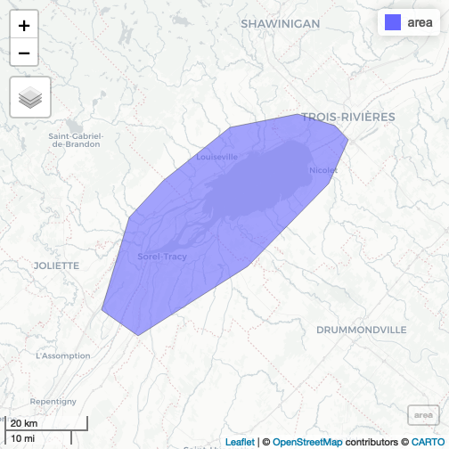
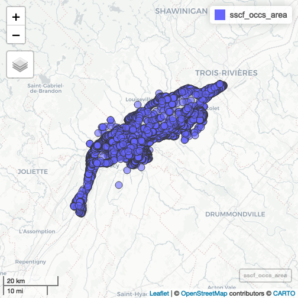

``` r
library(urgenceAviR)
```

## Load area of interest


``` r
area <- sf::st_read(system.file("exdata/threat_example.kml", package = "urgenceAviR"), quiet = TRUE) |>
  sf::st_transform(crs = sf::st_crs(32198))

mapview::mapviewOptions(fgb = FALSE)
mapview::mapview(area)
```



``` r

extent <- terra::ext(area)
```

## Load species reference backbone


``` r
species_ref <- urgenceAviR::get_species_codes(drop_subspecies = TRUE)
#> ℹ Load 688 species from species reference table
```

## SCF Data

Load SCF occurences data and transform to sf object


``` r
scf_occs <- urgenceAviR::load_all_datasets() |>
  dplyr::filter(!is.na(latitude) & !is.na(longitude) & !is.na(abondance) & !is.na(date)) |>
  sf::st_as_sf(coords = c("longitude", "latitude"), crs = sf::st_crs(4326)) |>
  sf::st_transform(scf_occs, crs = sf::st_crs(32198))
#> 
#> ── Loading all datasets ──────────────────────────────────────────
#> 
#> ── Canards de mer ──
#> 
#> ℹ Starting integration procedure on /Users/steve/inSileco Dropbox/Steve Vissault/UrgenceAviR/ConsultationCanardsDeMer.csv
#> ℹ Applying transformation on 645 rows
#> ℹ Load 688 species from species reference table
#> ✔ Returning 645 rows
#> 
#> ── Eider Hiver ──
#> 
#> ℹ Starting integration procedure on /Users/steve/inSileco Dropbox/Steve Vissault/UrgenceAviR/ConsultationEiderHiver.csv
#> ℹ Applying transformation on 10986 rows
#> ✔ Returning 10986 rows
#> 
#> ── Garrot ──
#> 
#> ℹ Starting integration procedure on /Users/steve/inSileco Dropbox/Steve Vissault/UrgenceAviR/ConsultationGarrot.csv
#> ℹ Applying transformation on 30185 rows
#> ℹ Load 688 species from species reference table
#> ✔ Returning 30185 rows
#> 
#> ── Macreuse ──
#> 
#> ℹ Starting integration procedure on /Users/steve/inSileco Dropbox/Steve Vissault/UrgenceAviR/ConsultationMacreuses.csv
#> ℹ Applying transformation on 4732 rows
#> ℹ Load 688 species from species reference table
#> ✔ Returning 4732 rows
#> 
#> ── Oies ──
#> 
#> ℹ Starting integration procedure on /Users/steve/inSileco Dropbox/Steve Vissault/UrgenceAviR/ConsultationOieDesNeigesPrintemps.csv
#> ℹ Applying transformation on 905 rows
#> ℹ Load 688 species from species reference table
#> ✔ Returning 905 rows
#> 
#> ── Sauvagine Fleuve ──
#> 
#> ℹ Starting integration procedure on /Users/steve/inSileco Dropbox/Steve Vissault/UrgenceAviR/ConsultationSauvagineFleuve.csv
#> ℹ Applying transformation on 16349 rows
#> ℹ Load 688 species from species reference table
#> ✔ Returning 16349 rows
#> 
#> ── BIOMQ ──
#> 
#> ℹ Starting integration procedure on /Users/steve/inSileco Dropbox/Steve Vissault/UrgenceAviR/consultationBIOMQ.xlsx
#> ✖ Failed to load dataset: biomq. Error: unable to load shared object '/Library/Frameworks/R.framework/Versions/4.3-x86_64/Resources/library/readxl/libs/readxl.so':   dlopen(/Library/Frameworks/R.framework/Versions/4.3-x86_64/Resources/library/readxl/libs/readxl.so, 0x0006): Symbol not found: _iconv   Referenced from: <F9E865B0-FD67-38F7-AB3F-1B57646A6434> /Library/Frameworks/R.framework/Versions/4.3-x86_64/Resources/library/readxl/libs/readxl.so   Expected in:     <867ACB81-DFB5-371B-B515-516A8450D634> /Library/Frameworks/R.framework/Versions/4.3-x86_64/Resources/lib/libR.dylib
#> 
#> ── SOMEC ──
#> 
#> ℹ Starting integration procedure on /Users/steve/inSileco Dropbox/Steve Vissault/UrgenceAviR/ConsultationSOMEC.csv
#> ✖ Failed to load dataset: somec. Error: Missing required columns in dataset:
#> 
#> ── Atlantic Colonies ──
#> 
#> ℹ Starting integration procedure on
#> ✖ Failed to load dataset: load_atlantic_colonies. Error: invalid 'file' argument
#> 
#> ── Combining datasets ────────────────────────────────────────────
#> ✔ Successfully combined datasets
```

Get occurences in area


``` r
sscf_occs_area <- sf::st_intersection(scf_occs, area)
#> Warning: attribute variables are assumed to be spatially constant throughout
#> all geometries
mapview::mapview(sscf_occs_area)
```



## Create one kernel by season and group of species

Split by season


``` r
sscf_occs_area <- sscf_occs_area |> dplyr::mutate(
  season = dplyr::case_when(
    lubridate::month(date) %in% 4:7 ~ "04050607",
    lubridate::month(date) %in% 8:11 ~ "08091011",
    lubridate::month(date) %in% c(12,1,2,3) ~ "12010203"
  )
) 
```

Subset ducks group


``` r
ducks <- dplyr::filter(sscf_occs_area, code_id %in% (species_ref |>
  dplyr::filter(stringr::str_detect(group, "duck")) |>
  dplyr::pull(code_id) |>
  unique())) |> dplyr::distinct()
```

Rasterize abundances by species group with 95th quantile  


``` r
library(stars)
# Create reference grid
grid <- terra::rast(area, resolution = 200)
q95 <- terra::rasterize(terra::vect(ducks), grid, field = "abondance", fun = quantile, probs = c(0.95), by = "season")
```

Plot raster values 


``` r
tmap::tmap_mode("view")
#> ℹ tmap mode set to "view".
tmap::tm_basemap(tmap::providers$CartoDB.DarkMatter) +
  tmap::tm_shape(log10(q95)) +
  tmap::tm_raster() +
  tmap::tm_facets(ncol = 2) +
  tmap::tm_layout(title = c("Printemps-Été", "Été-Automne", "Hiver")) 
#> [v3->v4] `tm_layout()`: use `tm_title()` instead of
#> `tm_layout(title = )`
#> [scale] tm_raster:() the data variable assigned to 'col' contains positive and negative values, so midpoint is set to 0. Set 'midpoint = NA' in 'fill.scale = tm_scale_intervals(<HERE>)' to use all visual values (e.g. colors)
#> 
#> [scale] tm_raster:() the data variable assigned to 'col' contains positive and negative values, so midpoint is set to 0. Set 'midpoint = NA' in 'fill.scale = tm_scale_intervals(<HERE>)' to use all visual values (e.g. colors)
#> 
#> [scale] tm_raster:() the data variable assigned to 'col' contains positive and negative values, so midpoint is set to 0. Set 'midpoint = NA' in 'fill.scale = tm_scale_intervals(<HERE>)' to use all visual values (e.g. colors)
#> Error in if (title != "") {: the condition has length > 1
```

Run kernel for each season based on observation points
Reference: https://r-spatial.org/book/11-PointPattern.html
https://www.paulamoraga.com/book-spatial/intensity-estimation.html


``` r
duck_seasons <- ducks |>
  dplyr::group_split(season)

densities_rs <- duck_seasons |> purrr::map(\(df){
  df_ppp <- spatstat.geom::as.ppp(df)
  density <- spatstat.explore::density.ppp(df_ppp, sigma = 1)

  # Go back to terra::rast
  density <- terra::rast(density)
  terra::crs(density) <- "epsg:32198"

  # Resample on based grid
  terra::resample(density, grid, method = "near")
})

# Remove negative densities and mask values
densities_rs <- purrr::map(densities_rs, \(r){
  # r <- terra::clamp(r, lower = 0, upper = Inf, values = FALSE)
  r <- terra::mask(r, area)
  r
}) |>
  terra::rast() |>
  setNames(c("Printemps-Été", "Été-Automne", "Hiver"))

tmap::tmap_mode("view")
#> ℹ tmap mode set to "view".
tmap::tm_basemap(tmap::providers$CartoDB.DarkMatter) +
  tmap::tm_shape(densities_rs) +
  tmap::tm_raster(title = "Kernel density estimation", palette = viridis::viridis(12)) +
  tmap::tm_facets(ncol = 2, free.scales = TRUE) +
  tmap::tm_layout(title = c("Printemps-Été", "Été-Automne", "Hiver"))
#> [v3->v4] `tm_tm_raster()`: migrate the argument(s) related to the
#> scale of the visual variable `col` namely 'palette' (rename to
#> 'values') to col.scale = tm_scale(<HERE>).
#> [v3->v4] `tm_raster()`: migrate the argument(s) related to the
#> legend of the visual variable `col` namely 'title' to 'col.legend
#> = tm_legend(<HERE>)'
#> tm_facets(): the argument free.scales is deprecated. Specify this via the layer functions (e.g. fill.free in tm_polygons)
#> 
#> [v3->v4] `tm_layout()`: use `tm_title()` instead of
#> `tm_layout(title = )`
#> Error in if (title != "") {: the condition has length > 1
```

## eBirds


``` r
ebird <- get_ebird(
  path = "/home/steve/Documents/UrgenceAviR_EmeRgencyApp/eBirdQC_juin2024_Extraction2024-11-04/eBird.gdb",
  species = unique(species_ref$nom_scient), var_species = "SCIENTIFIC_NAME", extent = extent
)
#> Error: [vect] file does not exist: /home/steve/Documents/UrgenceAviR_EmeRgencyApp/eBirdQC_juin2024_Extraction2024-11-04/eBirdQC_juin2024_Extraction2024-11-04.gdb
```

